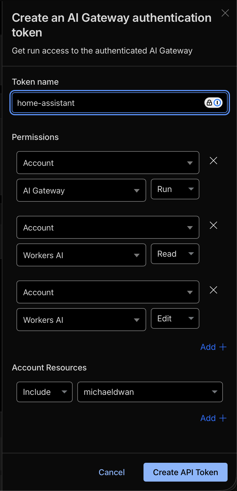
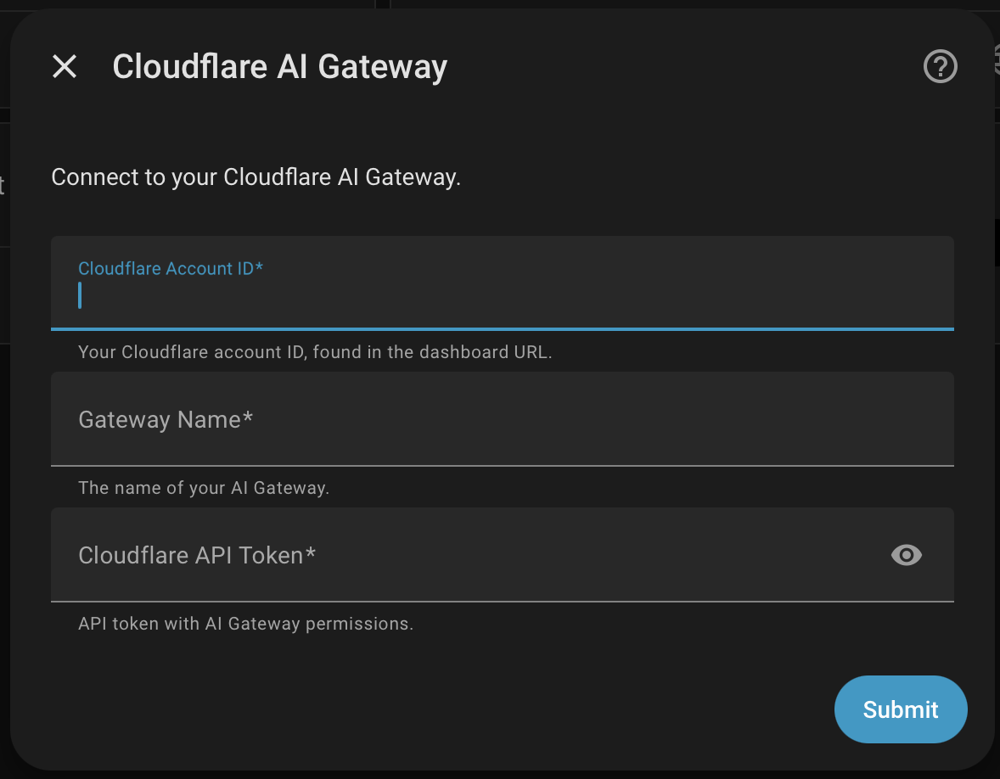
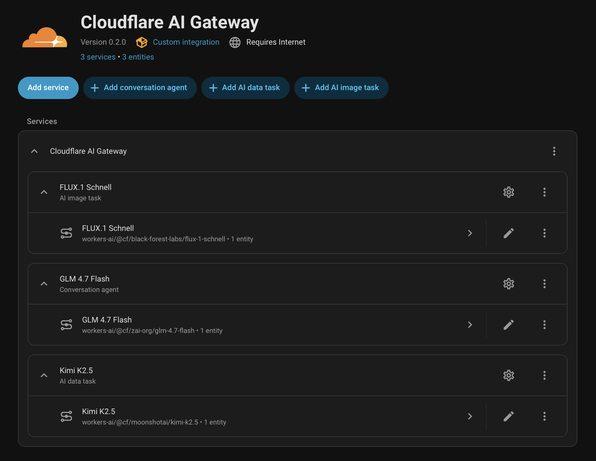

# Cloudflare AI Gateway for Home Assistant

[](https://github.com/michaeldwan/ha-cloudflare-ai-gateway/actions/workflows/validate.yml)
[](https://hacs.xyz/)

Connect your Home Assistant to hundreds of AI models from every major provider using [Cloudflare AI Gateway](https://developers.cloudflare.com/ai-gateway/). Out of the box support for 50+ high-performance, cost-effective ([or free!](https://developers.cloudflare.com/workers-ai/platform/pricing/)) open source models running on [Cloudflare Workers AI](https://developers.cloudflare.com/workers-ai/).

<!-- TODO: screenshot of conversation UI -->

## What it does

- **Mix and match models** -- add a fast Llama for everyday conversation, a reasoning model for complex automations, an image model for generation. Each becomes its own HA entity.
- **LLM models** become conversation agents (with tool calling) and AI task entities for data extraction and summarization
- **Image models** become AI task entities for on-demand image generation (Flux, Stable Diffusion, etc.)
- **Streaming** -- real-time token delivery in the conversation UI
- **Swap providers without reconfiguring** -- switch from Llama to Sonnet to Kimi by adding a new model. Your gateway config, system prompts, and automations stay put. You can also route to different models on the gateway itself.
- **Caching** -- per-model TTL to skip redundant API calls
- **Spend limits, rate limiting, and guardrails** -- set daily/weekly/monthly cost caps, request rate limits, and content safety rules in your [AI Gateway dashboard](https://developers.cloudflare.com/ai-gateway/features/). Configured in Cloudflare, enforced before requests hit providers.
- **Analytics and logging** -- every request is logged with status, latency, and token counts in the gateway dashboard, with the option for zero log retention if you prefer

## Installation

### HACS (recommended)

[](https://my.home-assistant.io/redirect/hacs_repository/?owner=michaeldwan&repository=ha-cloudflare-ai-gateway&category=integration)

Or manually: open HACS, click the three-dot menu > **Custom repositories**, add `michaeldwan/ha-cloudflare-ai-gateway` as an **Integration**, search for "Cloudflare AI Gateway" and install it, then restart Home Assistant.

### Manual

Copy `custom_components/cloudflare_ai_gateway/` to your Home Assistant `config/custom_components/` directory and restart.

## Cloudflare setup

You need a free Cloudflare account and three things from the dashboard: your Account ID, a gateway, and an API token. If you already have a Cloudflare account and an AI Gateway, skip to [step 3](#3-create-an-api-token).

### 1. Get your Account ID

Sign up or log in at [dash.cloudflare.com](https://dash.cloudflare.com/). You can find your Account ID by clicking on "Quick search" in the sidebar or the "cmd+k" hotkeys, then select "Copy account ID". It's also in every dashboard URL: `dash.cloudflare.com/<account-id>/...`.

### 2. Create an AI Gateway

Go to the AI Gateway config by clicking Build > AI > AI Gateway in the sidebar or selecting "AI Gateway" in the Quicksearch. Create a gateway -- the name you pick becomes the slug you'll enter in HA. There's no cost to create a gateway, so feel free to make one dedicated to your Home Assistant install.

### 3. Create an API token

On your gateway page, click the "Create token" button on the right sidebar. The default permissions are:



This is the token you'll use to authenticate the Home Assistant integration to this gateway.

For Workers AI models, this is the only credential you need. If you're using third-party providers (OpenAI, Anthropic, Google, etc.) and don't want consolidated billing, you'll need to add API keys in the "Provider Keys" section of your gateway settings.

### 4. Add the integration

[](https://my.home-assistant.io/redirect/config_flow_start/?domain=cloudflare_ai_gateway)

Or manually: **Settings > Devices & Services > Add Integration > Cloudflare AI Gateway**. 

Enter your Account ID, gateway name, and API token.



This will create 3 Workers AI models to get you started -- a general LLM model for conversation, a more capable reasoning model for specialized tasks, and an image generation model. You can customize or delete these and add your own models in the integration config page.



## Adding a model

From the integration page, click **Add model**:

- **Chat model** -- becomes a conversation agent and AI task entity. Pick a provider and model ID.
- **Image model** -- generates images via Workers AI.

For a quick start, use `workers-ai` as the provider and one of the models below. Each chat model has a system prompt, an [LLM API](https://www.home-assistant.io/integrations/conversation/) selection for tool calling, and optional tuning (temperature, top_p, max tokens, cache TTL).

## Recommended models

These are good starting points on Workers AI. The integration creates the first two and an image model by default. Workers AI has a [free tier](https://developers.cloudflare.com/workers-ai/platform/pricing/) (10,000 neurons/day) -- cheaper models stretch it further.

### Chat

All of these support function calling, which is what lets a model turn a voice command into an actual HA action.

| Model | Model ID | Cost | Notes |
|---|---|---|---|
| GLM-4.7 Flash | `@cf/zai-org/glm-4.7-flash` | Low | Fast and cheap. Default conversation model. Good everyday option. |
| Qwen3 30B | `@cf/qwen/qwen3-30b-a3b-fp8` | Low | Cheapest input cost of any function-calling model. Reasoning capable. |
| GPT-OSS-20B | `@cf/openai/gpt-oss-20b` | Low | Reasoning model at a fraction of Kimi's cost. |
| Mistral Small 3.1 | `@cf/mistralai/mistral-small-3.1-24b-instruct` | Medium | Good balance of capability and cost. |
| Kimi K2.5 | `@cf/moonshotai/kimi-k2.5` | High | Most capable reasoning model, but burns through the free tier fast. Default AI task model. |
| Llama 3.3 70B | `@cf/meta/llama-3.3-70b-instruct-fp8-fast` | High | Strong function calling. Similar cost tier to Kimi. |

### Image

| Model | Model ID | Notes |
|---|---|---|
| Flux Schnell | `@cf/black-forest-labs/flux-1-schnell` | Fast, good quality. Default image model. |
| Stable Diffusion XL | `@cf/stabilityai/stable-diffusion-xl-base-1.0` | Solid all-rounder. |

Browse the full [Workers AI model catalog](https://developers.cloudflare.com/workers-ai/models/) for more, and check the [pricing page](https://developers.cloudflare.com/workers-ai/platform/pricing/) for neuron costs per model.

### Using third-party providers

If you have keys for OpenAI, Anthropic, Google, or [other providers](https://developers.cloudflare.com/ai-gateway/providers/), add them to your [gateway settings](https://dash.cloudflare.com/?to=/:account/ai/ai-gateway/general) in Cloudflare. Then pick the provider and model ID when adding a model in HA (e.g., `openai` / `gpt-4o`). Cloudflare injects the right API key automatically -- nothing is stored in HA.

## Troubleshooting

**"Authentication error" or 403:** Your API token doesn't have the right permissions. Create a new one from your gateway page using the "Create token" button.

**Third-party model returns an error:** The provider's API key isn't configured in your [AI Gateway settings](https://dash.cloudflare.com/?to=/:account/ai/ai-gateway/general). Add it there, not in HA.

**Model chats but won't control devices:** You need to select an LLM API (Assist) in the model's configuration. Without it, the model can't call HA tools.

**Debugging requests:** Your AI Gateway dashboard shows every request with status codes, latency, and token counts. Check there first for provider-side issues.

## Requirements

- Home Assistant 2025.7.0 or later
- A Cloudflare account (free tier works)

## Contributing

```bash
mise install          # Python 3.13 + uv
uv sync               # Install dependencies
mise run validate     # Lint + format + tests (run before committing)
mise run develop      # Start HA in Docker at http://localhost:8123
```

## License

MIT
